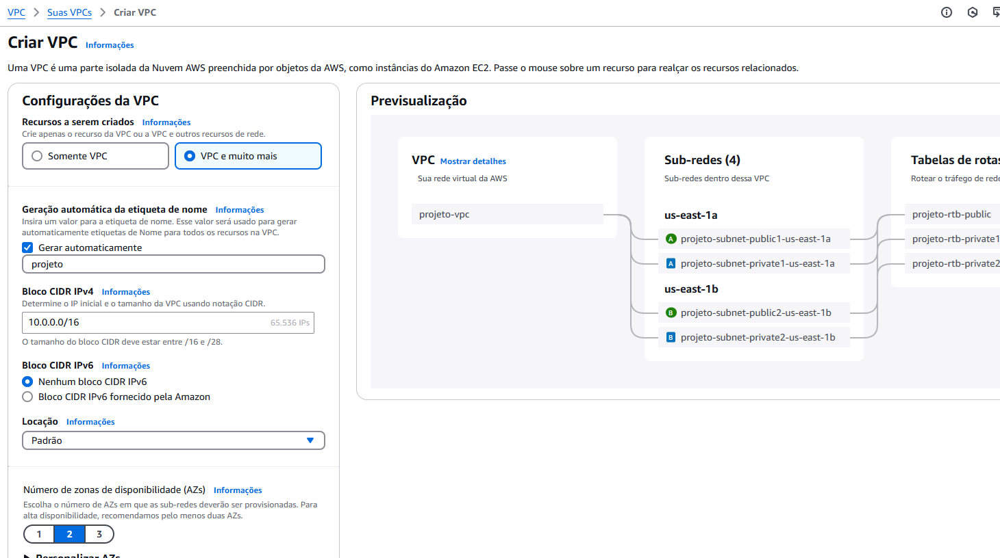
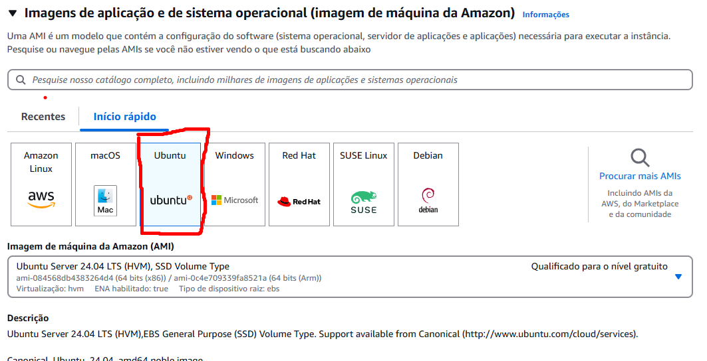
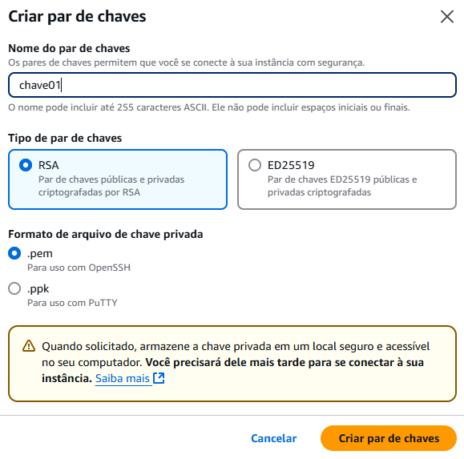
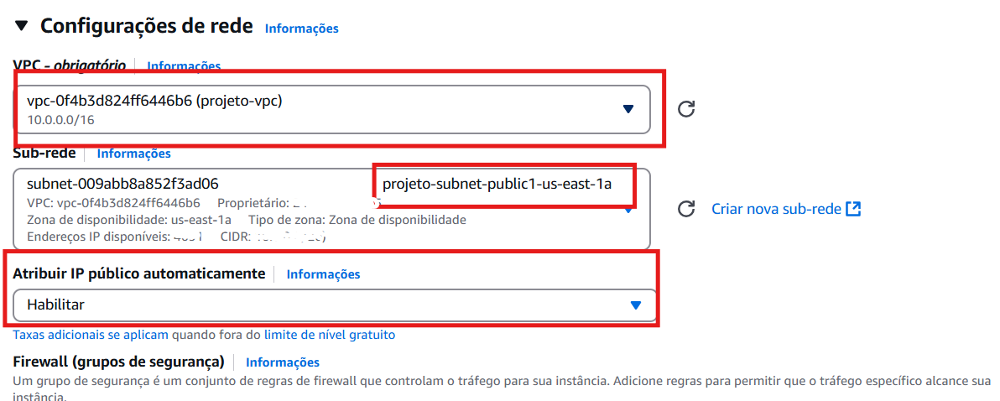
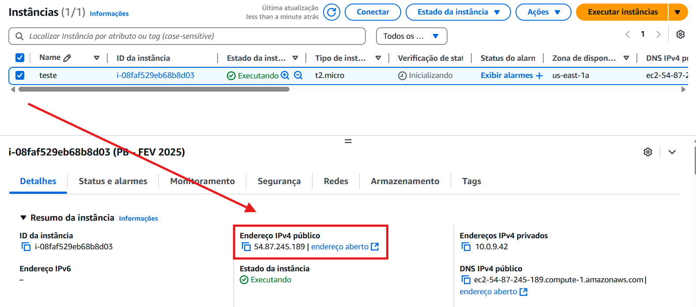
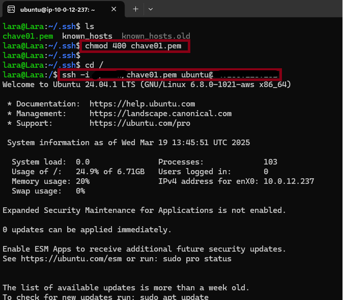
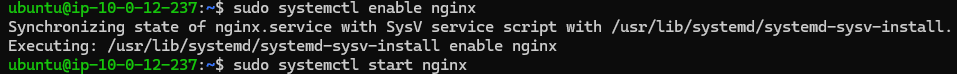
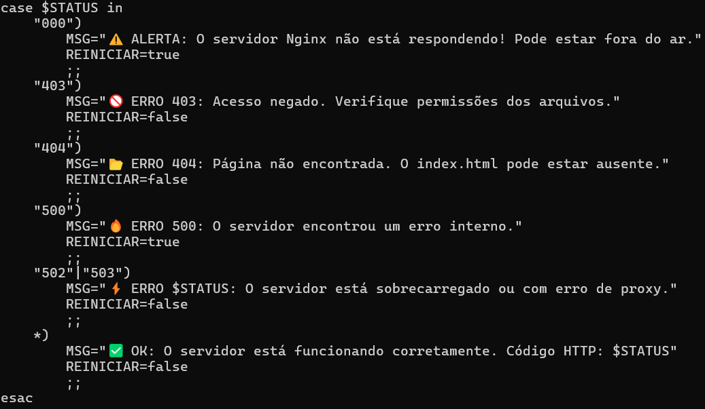

# Monitoramento de Site 🚀

Este projeto tem como objetivo monitorar a disponibilidade de um site hospedado em uma instância EC2 da Aws a cada minuto e registrar possíveis instabilidades.
Envia notificações via Telegram, e se necessário reinicializa o servidor Nginx.

## 📌 Funcionalidades
- ✅ Monitoramento contínuo do site
- 📊 Registro de data das verificações
- ⚠️ Notificações em caso de falhas
- 🔄 Reiniciar o servidor automaticamente em caso de erro no Nginx.


## 🔧 Tecnologias Utilizadas
- **Linguagem:** Bash, HTML, CSS e Linux
- **Ferramentas:** GitHub, Nginx, WSL

## ⚙️ Configurando a instância:
1. Crie uma VPC com 2 sub-redes públicas e 2 sub-redes privadas com um Gateway padrão:
    
2. Crie uma intância EC2 com a AMI Ubuntu:
    
3. Crie um par de chaves para poder se conectar a intância, do tipo .pem(caso esteja usando distribuições Linux):
    
4. Certifique-se sobre a conexão da vpc criada, e se está em uma sub-rede pública, e o IP público atribuído automaticamente
    
5. Crie um grupo de segurança com as seguintes regras:
    
    Com a conexão SSH liberado somente para a sua máquina local e o HTTP liberado para ser acessado dde qualquer IP.
6. Execute a intância e copie o IP público dela
    

## 🌐 Conexão e instalação dos pacotes necessários
1. Mova sua a chave criada que se encontra na em C:/Users/seu_Usuario/Downloads para o seu terminal Linux, neste caso estou usando o Ubunutu através da WSL(Subsistema do Windows para Linux):
    ```bash
    mv /mnt/c/Users/<seu_Usuario>/Downloads/chave.pem /home/<seu_usuario_ubuntu>/projeto
    ```
2. Altere as permições da chave:
    ```bash
    chmod 400 /home/<seu_usuario_ubuntu>/projeto/chave.pem
    ```
3. Conecte a instância através do comando:
    ```bash
    ssh -i /home/<seu_usuario_ubuntu>/projeto/chave.pem ubuntu@IP_DA_INSTANCIA
    ``` 
    obs: Passe o caminho de onde está a sua chave, e coloque o ip da sua instância
    
4. Agora já conectado na EC2, baixe os pacotes do Nginx e inicialize o serviço
    
    

## 🛠️ Criando Scrip e seus requisitos
1. Crie um diretório na pasta home para guardar seu script 
    ```bash
    mkdir ~/script
    ```
2. Entre na pasta e crie um arquivo de monitoramento do tipo shell
    ```bash
    sudo nano ~/script/monitoramento.sh
    ```
3. Crie uma pasta e o arquivo que irá armazenar seus logs e dê permissão de escrever no arquivo
    ```bash
    sudo mkdir /var/log/meus_logs
    sudo chown ubuntu:ubuntu /var/log/meus_logs

    touch /var/log/meus_logs/monitoramento.log
    ```
4. Coloque seu site no servidor movenedo o arquivo .html para a pasta padrão do Nginx 
    ```bash
    sudo mv /home/ubuntu/index.html /var/www/html/
    ```
5. Para verificar se o seu site foi hospedado corretamente, em seu navegador digite `http://IP_DA_INSTANCIA`, ele deve exibir o site que vc criou.

6. Escreva o seguinte script:
    
    1. 🔴 Indica o interpretador que irá usar para executar o script
    2. 🔵 Valida se foi passado o ip como parâmetro para execução do script, se sim, armagena na sua respectiva variável
    3. 🟢 Variável que armazena o caminho do arquivo onde irá armazenar as mensagens de monitoramento(log)
    4. 🟡 Variáveis de conexão com o telegram, que é o Token_BOT  e o id do chat desse bot
    5. 🟠 Variável, que após buscar a requisição do site, armazena o status de retorno
    6. 🟣 Variável que captura a data da requisição ao site e formata no padrão (ano/mês/dia)
    
    Usando 'case' para validar o status do site, armagenando mensagens especificas de acordo com os status: 000, 403, 404, 500, 502, 503, 200.
    
    1. 🔴 Uso o comando 'echo' para guardar a data com a mensagem no log que definimos na variável LOG
    2. 🟢 Manda uma notificação via telegram com a mensagem definida
    3. 🔵 A variável 'REINICIAR' armazena se o erro tem haver com uma queda do servidor, e caso seja uma queda no servidor ele vai tentar reiniciar o serviço
    4. 🟡 Valida se o serviço está ativo novamente e notifica via telegram que o serviço está ou não rodando
    `Salve seu script com Ctrl+o, Enter, Ctrl+x`
## 🚧 Configuração Cronjob
1. Editar o arquivo padrão de execução do cronjob e incluir script para ser executado a cada minuto
    ```bash
    crontab -e
    ```
    `Selecione a opção 1 para o usar o editor de texto nano`
    No final do arquivo inclua a linha `* * * * * /home/ubuntu/monitoramento.sh <ip da instância>`
    `Salve seu script com Ctrl+o, Enter, Ctrl+x`
2. Restartando o cron e habilitando inicialização junto com o sistema
    ```bash
    sudo systemctl restart cron
    sudo systemctl enable cron
    ```
