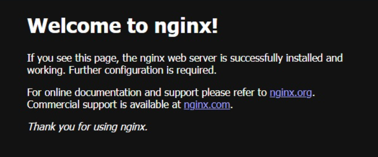
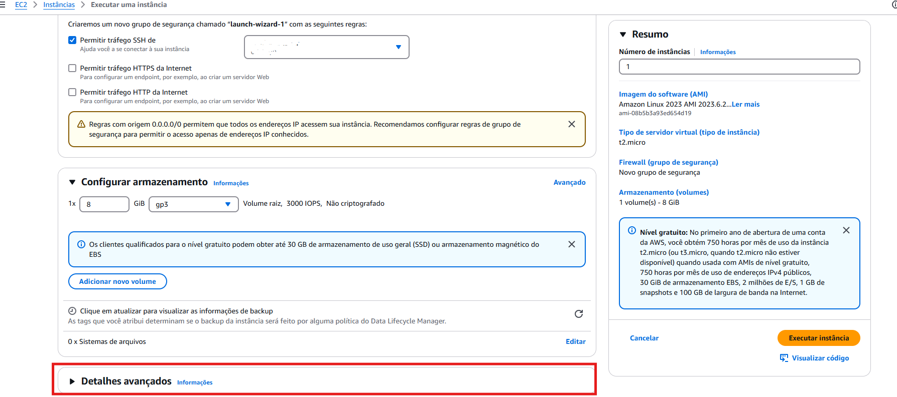
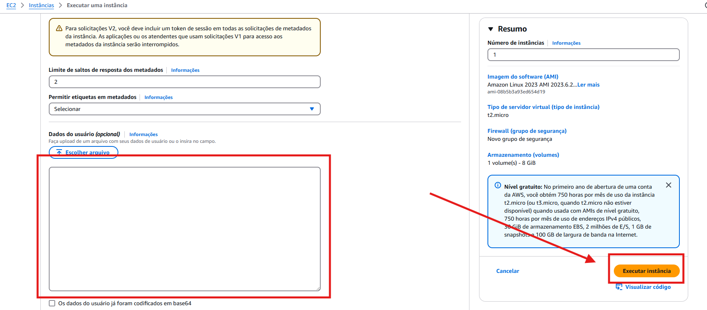
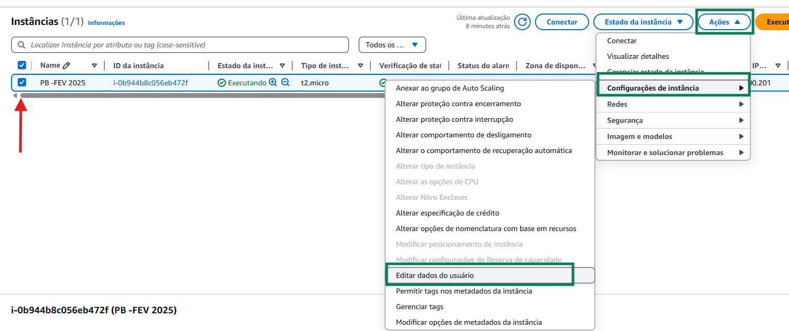
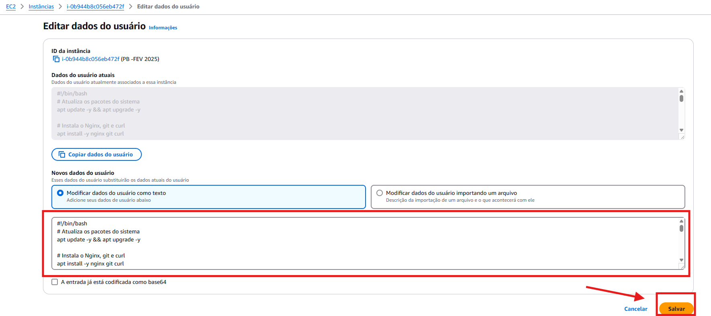

# Monitoramento de Site 🚀

## Sumário
- [📖 Introdução](#-introdução)
- [📌 Funcionalidades](#-funcionalidades)
- [🔧 Tecnologias Utilizadas](#-tecnologias-utilizadas)
- [⚙️ Configurando a instância](#️-configurando-a-instância)
- [🌐 Conexão e instalação dos pacotes necessários](#-conexão-e-instalação-dos-pacotes-necessários)
- [🤖 Criando o Bot Token do Telegram](#-criando-o-bot-token-do-telegram)
- [🛠️ Criando Script e seus requisitos](#️-criando-script-e-seus-requisitos)
- [🚧 Configuração Cronjob](#-configuração-cronjob)
- [Bônus Configuração automática com User Data](#bonus-configuracao-automatica-com-user-data)
- [📜 Conclusão](#-conclusão)

## 📖 Introdução
Este projeto tem como objetivo monitorar a disponibilidade de um site hospedado em uma instância EC2 da Aws e registrar possíveis instabilidades.
Envia notificações via Telegram, e se necessário reinicializa o servidor Nginx.

## 📌 Funcionalidades
- ✅ Monitoramento contínuo do site
- 📊 Registro de data das verificações
- ⚠️ Notificações em caso de falhas
- 🔄 Reiniciar o servidor automaticamente em caso de erro no Nginx.


## 🔧 Tecnologias Utilizadas

- **Linguagem:** Bash, HTML, CSS e Linux
- **Ferramentas:** GitHub, Nginx, WSL

## ⚙️ Configurando a instância:
1. Crie uma VPC com 2 sub-redes públicas e 2 sub-redes privadas com um Gateway padrão:
    

2. Crie uma intância EC2 com a AMI Ubuntu:
    

3. Crie um par de chaves para poder se conectar a intância, do tipo .pem(caso esteja usando distribuições Linux):
    

4. Certifique-se sobre a conexão da vpc criada, e se está em uma sub-rede pública, e com o IP público atribuído automaticamente
    

5. Crie um grupo de segurança com as seguintes regras:
    

    Com a conexão SSH liberado somente para a sua máquina local e o HTTP liberado para ser acessado de qualquer IP.

6. Execute a intância e copie o IP público dela
    


## 🌐 Conexão e instalação dos pacotes necessários

1. Mova sua a chave criada, que se encontra na em C:/Users/seu_Usuario/Downloads, para o seu terminal Linux, neste caso estou usando o Ubuntu através da WSL(Subsistema do Windows para Linux):

    ```bash
    mv /mnt/c/Users/<seu_Usuario>/Downloads/chave.pem /home/<seu_usuario_ubuntu>/projeto
    ```

2. Altere as permições da chave:
    ```bash
    chmod 400 /home/<seu_usuario_ubuntu>/projeto/chave.pem
    ```

3. Conecte a instância através do comando:
    ```bash
    ssh -i /home/<seu_usuario_ubuntu>/projeto/chave.pem ubuntu@IP_DA_INSTANCIA
    ``` 

    > obs: Passe o caminho de onde está a sua chave, e coloque o ip da sua instância

    

4. Agora já conectado na EC2, atulize os pacotes existentes, baixe os pacotes do Nginx e inicialize o serviço
    

    

5. No seu navegador, ao acessar `http://IP_DA_INSTANCIA` a página padrão do servidor Nginx deverá estar em exibição.
    

## 🤖 Criando o Bot Token do Telegram
1. No Telegram, na barra de pesquisa, buscar por @BotFather

2. Configurando o Bot:
    1. Envie o comando:
    ```bash
    /newbot
    ```

    2. Preencha um nome para o usuário bot, ele deve terminar com "bot" (Ex: Teste_bot)
    
    3. Se o nome estiver disponível ele vai responder com o seu TOKEN_BOT, guarde bem ele.

    4. Mande uma mensagem para seu Bot criado, pode ser um "OI" e no seu navegador busque por:
    ```bash
    https://api.telegram.org/botSEU_TOKEN_AQUI/getUpdates
    ```  

    5. Ele retornará um arquivo JSON, e o `"chat": { "id": ... }` é o seu Chat ID, guarde bem ele.


## 🛠️ Criando Scrip e seus requisitos

1. Crie um diretório na pasta home para guardar seu script 
    ```bash
    mkdir ~/script
    ```

2. Entre na pasta e crie um arquivo de monitoramento do tipo shell
    ```bash
    sudo nano ~/script/monitoramento.sh
    ```

3. Crie uma pasta e o arquivo que irá armazenar seus logs e dê permissão de escrever no arquivo
    ```bash
    sudo mkdir /var/log/meus_logs

    sudo chown ubuntu:ubuntu /var/log/meus_logs

    touch /var/log/meus_logs/monitoramento.log
    ```

4. Coloque seu site no servidor movendo o arquivo .html para a pasta padrão do Nginx 
    ```bash
    sudo mv /home/ubuntu/index.html /var/www/html/
    ```

5. Para verificar se o seu site foi hospedado corretamente, em seu navegador digite `http://IP_DA_INSTANCIA`, ele deve exibir o site que vc criou.

6. Escreva o seguinte script:

    
    >Neste exemplo o script recebe o IP como parâmetro, para poder ser executado e monitorar várias instâncias sem que precise alterar o documento em si 

    1. 🔴 Indica o interpretador que irá usar para executar o script
    2. 🔵 Valida se foi passado o ip como parâmetro para execução do script, se sim, armagena na sua respectiva variável
    3. 🟢 Variável que armazena o caminho do arquivo onde irá armazenar as mensagens de monitoramento(log)
    4. 🟡 Variáveis de conexão com o telegram, que é o Token_BOT  e o id do chat desse bot
    5. 🟠 Variável, que após buscar a requisição do site, armazena o status de retorno
    6. 🟣 Variável que captura a data da requisição ao site e formata no padrão (ano/mês/dia)

    

    Usando 'case' para validar o status do site, armazenando mensagens específicas de acordo com os status: 000, 403, 404, 500, 502, 503, 200.

    
    1. 🔴 Uso o comando 'echo' para guardar a data com a mensagem no log que definimos na variável LOG
    2. 🟢 Manda uma notificação via telegram com a mensagem definida
    3. 🔵 A variável 'REINICIAR' armazena se o erro tem haver com uma queda do servidor, e caso seja uma queda no servidor ele vai tentar reiniciar o serviço
    4. 🟡 Valida se o serviço está ativo novamente e notifica via telegram que o serviço está ou não rodando
    `Salve seu script com Ctrl+o, Enter, Ctrl+x`


## 🚧 Configuração Cronjob

1. Editar o arquivo padrão de execução do cronjob e incluir script para ser executado a cada minuto
    ```bash
    crontab -e
    ```

    `Selecione a opção 1 para o usar o editor de texto nano`
    No final do arquivo inclua a linha `* * * * * /home/ubuntu/monitoramento.sh <ip da instância>`
    `Salve seu script com Ctrl+o, Enter, Ctrl+x`

2. Restartando o cron e habilitando inicialização junto com o sistema
    ```bash
    sudo systemctl restart cron
    sudo systemctl enable cron
    ```

## Bônus Configuração automática com User Data
1. Incluindo User Data na criação da instância
    1. Crie sua instância, assim como no passo anterior [⚙️ Configurando a instância](#️-configurando-a-instância). Porém antes de executá-la vc irá rolar até a última configuração
    
    

    2. Vai rolar até o final dessa configuração e incluir o script abaixo no campo selecionado, e executar a sua instância

    

    ```bash
    #!/bin/bash
    # Atualiza os pacotes do sistema
    apt update -y && apt upgrade -y

    # Instala o Nginx, git e curl
    apt install -y nginx git curl

    # Habilita e inicia o serviço do Nginx
    systemctl enable nginx
    systemctl start nginx

    # Habilita e inicia o serviço do Nginx
    systemctl enable nginx
    systemctl start nginx

    # Clonar o repositório
    rm -rf /var/www/html/*
    git clone https://github.com/SEU_USUARIO/SEU_REPOSITORIO.git /tmp/repo

    # Copiar os arquivos para o diretório do Nginx
    cp -r /tmp/repo/pagina/* /var/www/html/

    # Renomear app.html para index.html
    mv /var/www/html/app.html /var/www/html/index.html 

    # Ajustar permissões
    chown -R www-data:www-data /var/www/html
    chmod -R 755 /var/www/html

    # Reiniciar o Nginx para aplicar as mudanças
    systemctl restart nginx

    # Cria diretório para logs do monitoramento
    mkdir -p /var/log/meus_logs

    # Cria o script de monitoramento
    cat << 'EOF' > /usr/local/bin/monitoramento.sh
    #!/bin/bash

    IP="$(curl -s ifconfig.me)"  # Obtém IP público da instância
    URL="http://$IP"
    LOG="/var/log/meus_logs/monitoramento.log"

    TELEGRAM_TOKEN="<SEU_BOT_TOKEN>"
    TELEGRAM_ID="<SEU_CHAT_ID>"
    API_URL="https://api.telegram.org/bot$TELEGRAM_TOKEN/sendMessage"

    STATUS=$(/usr/bin/curl -o /dev/null -s -w "%{http_code}" "$URL")
    DATA=$(date +"%Y-%m-%d %H:%M:%S")

    case $STATUS in
        "000")
            MSG="⚠️ ALERTA: O servidor Nginx não está respondendo! Pode estar fora do ar."
            REINICIAR=true
            ;;
        "403")
            MSG="🚫 ERRO 403: Acesso negado. Verifique permissões dos arquivos."
            REINICIAR=false
            ;;
        "404")
            MSG="📂 ERRO 404: Página não encontrada. O index.html pode estar ausente."
            REINICIAR=false
            ;;
        "500")
            MSG="🔥 ERRO 500: O servidor encontrou um erro interno."
            REINICIAR=true
            ;;
        "502"|"503")
            MSG="⚡ ERRO $STATUS: O servidor está sobrecarregado ou com erro de proxy."
            REINICIAR=false
            ;;
        *)
            MSG="✅ OK: O servidor está funcionando corretamente. Código HTTP: $STATUS"
            REINICIAR=false
            ;;
    esac

    echo "$DATA - $MSG" >> $LOG
    /usr/bin/curl -s -X POST $API_URL -d chat_id=$TELEGRAM_ID -d text="$MSG" > /dev/null

    if [[ "$REINICIAR" == true ]]; then
        echo "$DATA - Tentando reiniciar o Nginx..." | sudo tee -a $LOG
        sudo systemctl restart nginx
        if systemctl is-active --quiet nginx; then
            MSG="🔄 O Nginx foi reiniciado com sucesso!"
        else
            MSG="❌ Falha ao reiniciar o Nginx!"
        fi
        /usr/bin/curl -s -X POST $API_URL -d chat_id=$TELEGRAM_ID -d text="$MSG" > /dev/null
    fi
    EOF

    # Permissão para execução do script
    chmod +x /usr/local/bin/monitoramento.sh

    # Agendando o script no cron para rodar a cada 5 minutos
    echo "*/1 * * * * root /usr/local/bin/monitoramento.sh" >> /etc/crontab

    # Mensagem de conclusão
    echo "Configuração concluída. Nginx e monitoramento ativos!" > /var/log/meus_logs/setup.log
    ```

    > 💡 **Observação:** Para que funcione esse script com o site que eu escrevi, hospedei o meu site no repositório git, estou clonando ele e renomeando minha página .html para o padrão de leitura do Nginx que é o index.html

    3. Caso precise editar o User Data:

        

        

        Use o campo editável para alterar ou fazer qualquer substituição no User Data, e salve suas modificações

        


## 📜 Conclusão
Este projeto implementa um servidor web na AWS com Linux e Nginx, focando em alta disponibilidade e monitoramento eficiente. Ele inclui automação para manter o serviço ativo e notificações via Telegram para alertas em caso de falhas. Além disso, utiliza SystemD e logs personalizados para uma administração eficaz.
Agora você tem um scrip de monitoramento de site, prático e rápido para alterar, melhorar e fazer todos os testes e validações que quiser. Use sem moderação!


